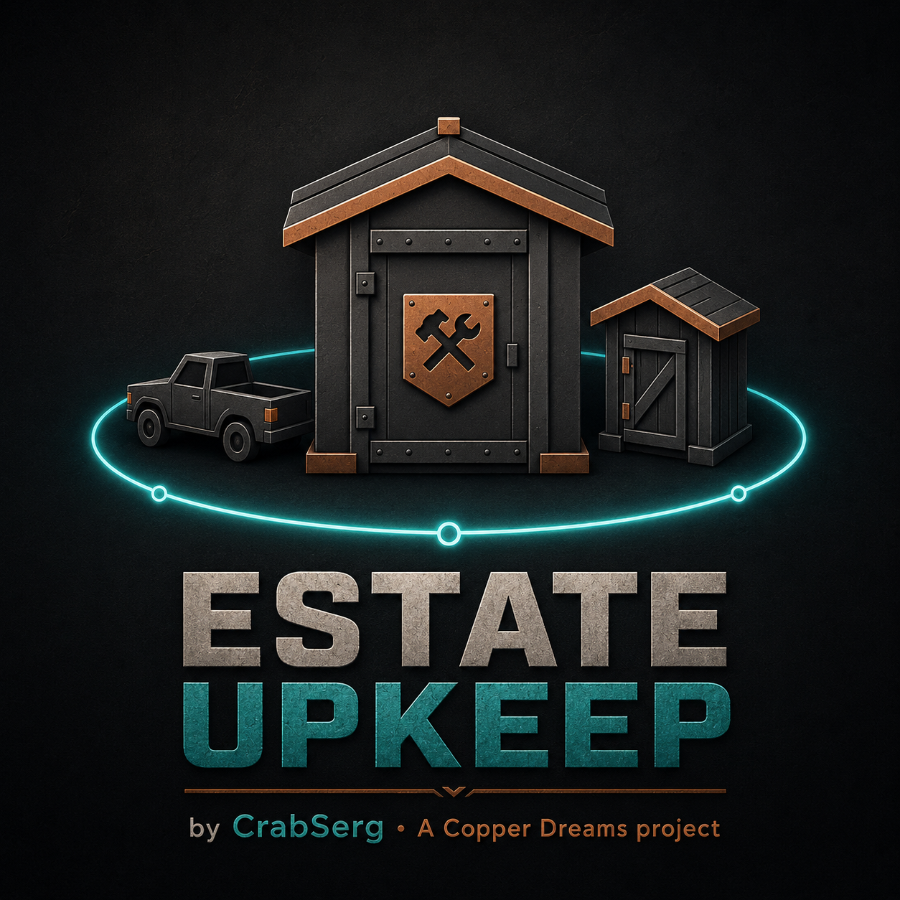

<p align="center">
  
</p>

<h1 align="center">Estate Upkeep</h1>

<p align="center">
  <strong>by CrabSerg • A Copper Dreams project</strong>
</p>

<p align="center">
  Rust plugin for detached estate upkeep, decay protection and protected transport.
</p>

**Version:** 1.0.1  
**License:** GPL-3.0-or-later  
**Copyright:** © 2026 CrabSerg

> Free and open-source Core release. Modified builds must not be represented
> as official CrabSerg / Copper Dreams releases.

Estate Upkeep extends normal Tool Cupboard upkeep to **authorized detached structures** that are physically covered by the TC privilege zone but are not part of the TC's own building. It can also optionally protect supported vehicles from Rust decay while they are parked inside a TC privilege zone.

## Features

### Detached Estate Upkeep
- Detects detached physical buildings inside a TC privilege zone.
- A detached building is eligible only when:
  - it does not have its own building privilege;
  - every owned building block is owned by a player authorized on the covering TC;
  - the whole detached building resolves to the same TC privilege.
- Uses Rust building grades, construction costs, upkeep period and vanilla upkeep tax brackets to calculate the extra charge.
- Door/window deployables associated with the detached structure are included where their blueprint cost can be resolved.
- One TC pays only for its own Estate. Multiple TCs are **not pooled** into a shared resource network.
- Billing is automatic and persistent.

### Decay Protection and Repair
- Paid Estate structures are protected from Rust decay.
- Only HP that Estate Upkeep tracked as **decay damage** is eligible for automatic repair.
- Combat, raid and other non-decay damage is not treated as free repair debt.
- Default repair speed is 1% of max HP per minute, processed in 30-second ticks.

### Optional Transport Anti-Decay
Transport protection is **OFF by default** for public installs and can be enabled with:

`/estate transport on`

When enabled:
- suppresses only `DamageType.Decay`;
- requires the supported transport to be physically inside a TC privilege zone;
- never consumes TC upkeep resources;
- supports land, water and air categories;
- includes modular cars, motorbikes/bicycles, snowmobiles, boats/submarines/tugboats and supported aircraft identified by Rust runtime/prefab types.

### Restart HP Preservation
Protected transport HP is checkpointed during normal runtime.

The restart system:
- distinguishes plugin reloads from real Rust process restarts;
- does not require the clean-shutdown hook to fire;
- reconciles late-spawning transport for up to 90 seconds after startup;
- resolves modular-car child modules to the canonical parent vehicle root;
- does not intentionally heal damage that already existed before restart;
- blocks restart healing when genuine external sourced damage occurs during the reconcile window.

## Commands

### Player commands
- `/estate` — Estate status for the TC privilege zone you are standing in.
- `/estate status` — same status view.
- `/estate help` — command help.
- `/estate transport status` — transport protection status.

### Admin commands
Server owners are accepted automatically. Delegated admins can be granted:

`estateupkeep.admin`

Commands:
- `/estate transport on`
- `/estate transport off`
- `/estate transportcheck`
- `/estatecheck`
- `/estateperf`
- `/estatechargecheck`
- `/estatecharge confirm`
- `/estaterepaircheck`
- `/estaterepairmark`

`/estatechargecheck` is a dry run.  
`/estatecharge confirm` performs a real guarded 24-hour test charge.

## Configuration

The plugin creates its config automatically. Public defaults keep transport protection disabled until the server owner opts in.

Example:

```json
{
  "VehicleProtection": {
    "Enabled": false,
    "PreventDecayInsideTc": true,
    "ProtectLand": true,
    "ProtectWater": true,
    "ProtectAir": true,
    "RestoreProtectedHpAfterCleanRestart": true,
    "RestartMatchRadiusMeters": 8.0,
    "RestartCheckpointMaxAgeAtShutdownSeconds": 90.0
  }
}
```

### Configuration notes

- `Enabled`: master switch for transport anti-decay.
- `PreventDecayInsideTc`: suppress Rust decay for eligible transport inside TC privilege.
- `ProtectLand`, `ProtectWater`, `ProtectAir`: category switches.
- `RestoreProtectedHpAfterCleanRestart`: retained field name for backward config compatibility; v1.0 uses Rust process-boot detection and does not require a clean-shutdown hook.
- `RestartMatchRadiusMeters`: positional tolerance used only for restart snapshot matching.
- `RestartCheckpointMaxAgeAtShutdownSeconds`: legacy compatibility guard for older stored checkpoints.

## Installation

1. Copy `EstateUpkeep.cs` into your server's plugins directory.
2. Let Carbon/Oxide compile and load it.
3. Check the server console for the `Estate Upkeep` load message.
4. Use `/estate help`.
5. Optional: enable transport protection with `/estate transport on`.
6. Optional delegated admin permission:
   - grant `estateupkeep.admin` using your framework's permission command.

Existing Estate Upkeep data/config is preserved by the plugin's persistent storage system.

## Performance Design

Estate Upkeep performs one full-world entity enumeration at plugin startup to build its caches. Normal recurring Estate snapshots use maintained caches and do **not** enumerate `BaseNetworkable.serverEntities`.

Transport membership/checkpoint refresh uses the supported-transport cache and does not charge TC resources.

## Safety / Design Guarantees

- Independent TC Estates only; no shared TC resource pool.
- Transport protection never withdraws resources from the TC.
- Transport anti-decay suppresses only Rust decay damage.
- Estate auto-repair is limited to tracked decay repair debt.
- Real external damage during transport restart reconciliation is not intentionally restored.
- A plugin hot reload is not treated as a full server restart.

## v1.0.x Regression Result

The release candidate completed the modular-car restart test with:
- 14 restart snapshot records loaded;
- 14 matched;
- 0 unmatched;
- vehicle HP unchanged across restart.

## Support Diagnostics

If troubleshooting, use `/estateperf` and `/estate transportcheck` as an admin. These expose cache, restart reconciliation, transport matching and damage-disqualification state.


## v1.0.1 Initialization Safety

v1.0.1 adds an idempotent `OnServerInitialized` guard. If the server framework
delivers the initialization hook more than once to the same plugin instance,
Estate Upkeep ignores the duplicate call instead of creating a second set of
billing, repair, cache-refresh and persistence timers.

## Official Project Identity

Official releases use the identity:

**Estate Upkeep by CrabSerg • A Copper Dreams project**

The source code is licensed under GPL-3.0-or-later. The project identity,
names and visual branding must not be used to falsely present a modified
or third-party build as an official CrabSerg / Copper Dreams release.

See `NOTICE.txt` for attribution and identity guidance.
